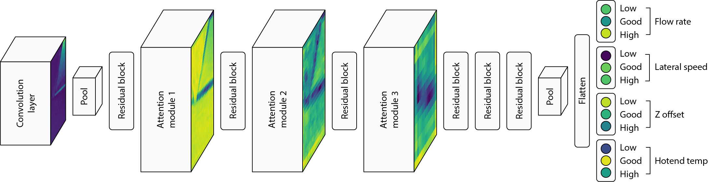
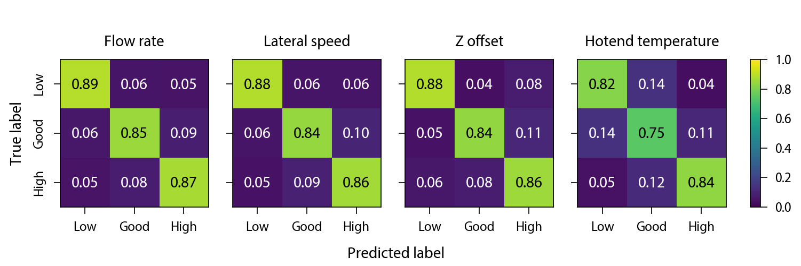
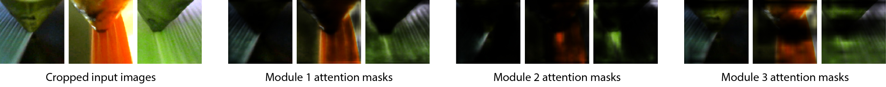

# CAXTON: The Collaborative Autonomous Extrusion Network

_Accompanying code to the publication "Generalisable 3D Printing Error Detection and Correction via Multi-Head Neural Networks"_



## Setup

This repository allows you to easily train a multi-head residual attention neural network to classify the state of the four most important printing parameters: flow rate, lateral speed, Z offset, and hotend temperature from a single input image.

First create a Python 3 virtual environment and install the requirements - this should only take a couple of minutes. We used PyTorch (v1.7.1), Torchvision (v0.8.2), and CUDA (v11.3) in this work. See the complete list of requirements in `requirements.txt`. 

```
virtualenv -p python3 env
source env/bin/activate
pip install -r requirements.txt
```

## Usage

Inside the `src` directory are two sub-directories for our `data` and `model`. We use Pytorch-Lightning (v1.1.4) as a wrapper for both the dataset and datamodule classes and for our model.

Various settings can be configured inside the `src/train_config.py` file such as the number of epochs, learning rate, number of GPUs, batch size etc. Also in this file are the pixel channel means and standard deviations used to normalise the image data during training. 

To train the network use the follow line:

```
python src/train.py
```

The command line arguments `-e` for number of epochs and `-s` for the seed can be easily added to the above command.

After training the network is able to simulatneously predict the classification of the four parameters from a single input image with an average accuracy of 84.3%.



The network successfully self-learns the important features in the images during training, and attention maps aid in focusses on the latest extrusion for making predicitions. Here we show example attention masks at each module for the given input images. Each module output consists of many channels of masks, only a single sample is shown here. The masks show regions the network is focussing on, such as the most recent extrusion as shown by the output of module 2.



In the publication we provide a three step transfer learning process to achieve high accuracies in this problem. It should be noted that this step is not necessary and training can be completeled in an end-to-end fashion with a single training regime.

## Results from samples in repo

The results for the models in this work were trained on a workstation running Ubuntu 18.04 equipped with an i9-9900K, 64GB RAM, 2x Nvidia Quadro RTX 5000 GPUs.

In the top level `data` directory there are 8 cropped and full sample images of different parameter combinations for a range of prints. These are labelled `sampleABCD.jpg` where each of A, B, C, and D are numbers 0, 1, and 2 corresponding to low, good, and high levels respectively. Each letter is for the four different parameters: A - Flow rate, B - Lateral speed, C - Z offset, D - Hotend temp.

You can test these samples with the provided script and should receive an output similar to the one below. On our system iterating through each sample individually takes around 0.07s per sample. Naturally if the batch size is increased the rate per sample can be greatly increased.

```bash
python src/samples.py

********* CAXTON sample predictions *********
Flow rate | Lateral speed | Z offset | Hotend
*********************************************
Input: sample1221.jpg -> Prediction: [1 2 2 1]
Input: sample2122.jpg -> Prediction: [2 1 2 2]
Input: sample1111.jpg -> Prediction: [1 1 1 1]
Input: sample0022.jpg -> Prediction: [0 0 2 2]
Input: sample2011.jpg -> Prediction: [2 0 1 1]
Input: sample0021.jpg -> Prediction: [0 0 2 1]
Input: sample2120.jpg -> Prediction: [2 1 2 0]
Input: sample1011.jpg -> Prediction: [1 0 1 1]
Completed 8 predictions in 0.56s
```
